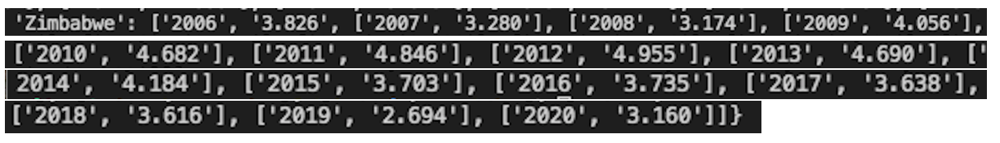
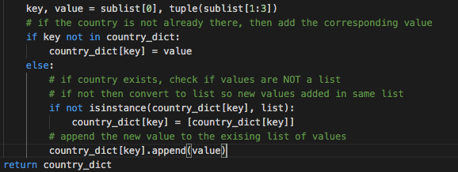
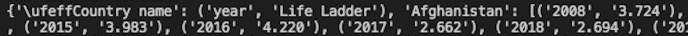
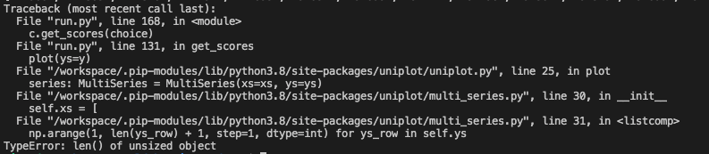
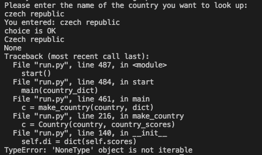
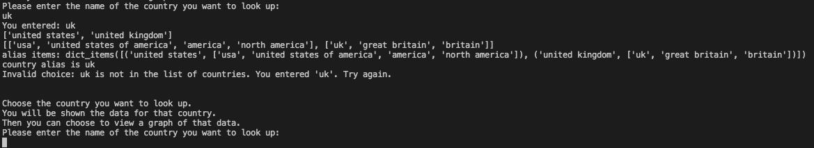
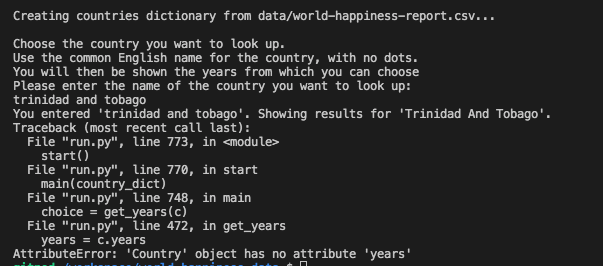
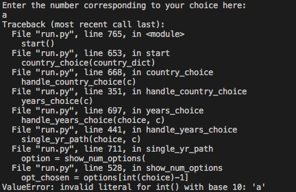

# World Happiness Data
---
*Note: this project was created for educational purposes as a student of Code Institute.*

World Happiness Data is a tool to provide requested happiness scores from the World Happiness datasets from 2005 to 2020. It is a command line application and runs in a mock terminal provided by Code Institute. Users can select a country, get the happiness score for a specified year or all recorded years, view a graph of the happiness scores over time, and get the maximum, minimum, average and median happiness scores for the particular country.

[View the live application here.](https://world-happiness-data.herokuapp.com/) 

## Table of Contents

## Purpose
---
The [World Happiness Reports](https://worldhappiness.report/) are annual publications which interpret and draw conclusions from data collected from people in over 150 countries. 

The World Happiness Data tool is a command-line application allowing users to look up a dataset containing the happiness scores from the World Happiness Reports over the years 2005 to 2020 inclusive. For example, to look at data for a particular country so that they can see how the happiness score changed over time. 

A user can choose a country and then:
- request the happiness score for a particular year for that country
- request the happiness score for all the available years for that country, and then, if selected, see a graph of these scores over time
- request the maximum, minimum, average or mean happiness score for that country, or request all of these scores.
The user can choose a different country while in the application, after they have viewed the data they wanted for the previous country. 

The application provides the requested data, and the graph if selected, to the user by printing it to the terminal. 

The target market is relatively broad. In general, it would be people with a passing interest in the Happiness Reports, perhaps piqued when the results are announced each year in the general news. It is not aimed at people with in depth knowledge of the Happiness Reports nor those who want to do in depth data visualisations. The usefulness of the tool lies in the ability to quickly extract information from the large dataset. 

### User’s goals:
- the users of the tool want to access the happiness scores for a country or countries, within the years 2005 - 2020 
- the user may want to view the score from a particular year, or for all years available for the chosen country
- the user may also want to view a graph representing the happiness scores over time for a country, or get more information on that country such as maximium, minimum, average scores for that country.

### Site owner’s goal:
- the goal of this tool is to provide an easy way for users to get different information from the World Happiness historical scores dataset, by requesting and viewing the results to the terminal.

## User Experience (UX)
---
### User stories
*Note:* there is no login or registered users for this application, so each user story is from the point of view of a visiting user using the application.
1. As a visiting user, I want to understand what data I can access from the application so that I know what information I can get from it
2. As a visiting user, I want to be able to choose a country so that I can view the data related to that country
3. As a visiting user, I want to see the happiness score for a particular year (from those available) for my selected country
4. As a visiting user, I want to be able to see the happiness score over time for a particular country, so that I can see the scores and trends over time for that country
5. As a visiting user, I want to be able to see a graph of the happiness score over time for a particular country so that I can visualise the data more easily
6. As a visiting user, I want to be able to see the maximum, minimum, average and median happiness score for my selected country. 
7. As a visting user, I want to be able to select one option at a time from: maximum, minimum, average and median happiness score for my selected country

### Design
*Note:* Since the application runs in the terminal, there is no design of the user interface. 

The deployed application runs in a mock terminal on Heroku in order to demonstrate the project, the design of the mock terminal is built into the template provided by Code Institute.

The font 'ogre' is used to print the banner message on starting and exiting the application, using [pyfiglet](https://pypi.org/project/pyfiglet/). pyfiglet uses fonts created from ASCII characters, the 'ogre' font generates a readable banner message. 

Limited use of colour for the text pritned to the terminal is possible, using [termcolor](https://pypi.org/project/termcolor/). Error messages are printed in red text, while outputs of information are printed in yellow so that they stand out to the user amongst the other text in the terminal.

### Flow Chart
[View the flowchart here](docs/flowchart.pdf), showing the steps that run in the application, how the user can move through the application and the user options at each stage. 

The application is split into different 'paths' or sections. Each section is a path that the user can link into from a different section of the application, when they are presented with options. (Except for the `one_score_path()` which is not selected by the user, but determined by their choice of country - there are five countries in the dataset where the happiness score is only recorded for one year.) At the end of each section the user is presented with options, and put onto the new relevant path (or exit the application), based on their choice.

## Features
---
### Existing Features
- Welcome message with short note on the purpose of the application
- Option for user to input the country name they want
- Exception handling for the country choice 
- When a valid country is entered, show the years for which the happiness score is available for that country, since the dataset does not have a score recorded for every year for some countries. User can then choose from these years.
- Option for user to choose the year they want to view for that country, or all years
- Exception handling for the user input to the years choice input
- Option for user, if they have chosen to view all years, to choose if they want to view a graph of the data. This will be the happiness score for that country over time
- Exception handling for the user input to the Y/N choice input
- Option for user, if they originally chose a single year, to then view all years for the selected country
- Option for the user to choose a different year for the selected country, after viewing a single year's score or viewing all years' scores (this option is not applicable when a country only has one score for one year)
- Option for user to view min, max, median, average, or all of these values, for the selected country - this option can be chosen after selecting a single year's score to view, or after selecting all years, but is not available when a country only has one score
- Option for user to go back and select another option from min, max, median, average, or all options (e.g. they chose max first time, can go back and chose min or all, etc.)
- Option for user to choose a different country, or to exit programme when they have viewed their data 
- There are five countries in the dataset that only have a score recorded for one year. If the user chooses these countries, show the score and year along with a note confirming this is the only year available, and the option to choose a different country/exit
- Exception handling for the user inputs when selecting an option from the list of numbered options
- Exit message confirming to user that they are exiting the application, and how to re-run the application 
- For the country choice user input, accept different alternative/alias names for the countries as far as possible, for example 'britain' will retrieve data for United Kingdom. 
- For user inputs requiring text, accept lowercase, uppercase, titlecase and combinations of same, for example iReLanD will retrieve data for Ireland. 

### Future Features

## Content Requirements
---
Th content required to create the project was the dataset with which the user will interact. It contains the happiness score for each country over the years 2005 - 2020 inclusive. Not every country has a score in every year, due to the way the data is collected. The [dataset was sourced from Kaggle](https://www.kaggle.com/ajaypalsinghlo/world-happiness-report-2021?select=world-happiness-report.csv).

Explanation of Happiness score:
>It is referred to as "Life Ladder" in the dataset. This is the metric used to rate happiness and is based on a "Cantril life ladder" or subjective life evaluation. Survey respondents are asked to think of a ladder, with the best possible life for them being a 10, and the worst possible life being a 0. They are then asked to state which step of the ladder they feel they are at currently. The score for each country is the national average of each respondent's answer. The other metrics such as GDP, Social Support etc. are used by the Happiness Reports to explain the Life Ladder or Happiness score.

## Technology
---
### Languages
- Python 

*Note: HTML, CSS and Javascript exist in the template provided by Code Institute for this project but these are to run the mock terminal. The programme itself is built purely using Python.*

### Frameworks, Libraries, Programmes and Tools
- [Lucidchart](https://www.lucidchart.com/) to create the flowchart showing the user paths through the application
- Git for version control, using the [Gitpod](https://www.gitpod.io/) terminal to commit to Git and push to GitHub
- [GitHub](https://github.com/) to store the project code
- [Heroku](https://www.heroku.com/) to host the live application
- [pyfiglet](https://pypi.org/project/pyfiglet/) for the fonts used in the banner messages on entering and exiting the application
- [termcolor](https://pypi.org/project/termcolor/) to apply colours to the text printed to the terminal
- [uniplot](https://github.com/olavolav/uniplot#readme) to create the graphs that can be displayed in the terminal (uniplot uses [numpy](https://numpy.org/))

## Data Model
---
The data for the application is contained in a csv file. The csv file contains the following headings that are used in the application: "Country name", "year", and "Life Ladder". (There are further headings in the csv file however these are not used in the application since the focus of the appplication is the happiness score only - referred to as "Life Ladder" in the csv file.) The csv file contains a line for each year and it's associated score - so for example, a country with scores recorded for 12 years will have 12 lines in the csv file. 

Within the application, the relevant data from csv file is first used to create a `dictionary`, `country_dict`, containing `key value` pairs as follows: 
- `key` = country name, 
- `value` = list of tuples each containing year and score pairs for that country (or if country has only one score, this is a single tuple containing year and score)

Following on from this, the `Country class` is used as the data model. The `Country class` stores the following information:
- name: country name
- scores: a `list` of `tuples` containing the year and associated score, this is the `value` from the countries `dictionary` mentioned above.

If the country has more than one score recorded (this is the case for the majority of the countries) then the following information is also stored in the Class:
- `dictionary` with years as the `key` and happiness score for that year as the `value`
- `list` of the happiness scores, converted to `floats` so that they can be used for plotting the graph, getting maximum, minimum, average, median.
- `list` of the years converted to `int` so that they can be used for plotting the graph, getting maximum, minimum, average, median.

An instance of `Country class` is created by the `make_country` function, each time the user selects a country that they want to view the scores/data for, in the `get_country function`(the instance is created after the country input has been validated). The `class` instance is created using the country name, and the `list` of year and scores `tuples` retrieved from the countries `dictionary`.

The methods in the `Country class` are used throughout the application, to get the information for the relevant country, to present to the user in the terminal:
- `show_scores`: prints the requested score(s) to the terminal for the requested year or years
- `show_graph`: uses plot function from uniplot to plot a graph in the terminal showing all available happiness scores over time
- `show_min_score`, `show_max_score`: these methods print the min or max score for the country to the terminal, along with the corresponding year for that score
- `show_median_score`, `show_average_score`: these methods print the median or average score for the country to the terminal

## Testing
---
### Code Validation
The Python code has been validated using [PEP8 online checker](http://pep8online.com/). Errors that were raised were: `line too long (86 > 79 characters)` relating to strings for user input that were too long. This was corrected by wrapping the string onto multiple lines.

 There are no validation errors in the sumitted code.

### Test Cases - user stories
### Fixed Bugs
The following bugs were encountered during development and during testing.
- **Issue: Creating countries dictionary: appending the year and score pair to existing country value creates a list within a list:**

In the `create_countries_dict` function, a dictionary is created from the source csv file that contains the data. The csv file contains a line per country, each line for a different year, when opening the csv file I first converted it to a list of lists. In creating the dictionary from the list of lists, the country name is the `key`, and the `value` is a list of the year and score pairs from each year. If the country has already been added to the dictionary, then the new year and score pair needs to be added to the existing `value` for that country - to create a list of year and score pairs. The original code is below:

This code resulted in the first year and score pair being added as the value, but the subsequent year and score pairs being appended as sub-lists *within* the existing list of the first year and score. As can be seen in the example below for Zimbabwe:

>Solution: Made the year, score pair a `tuple`. Added a check when checking if the `key` already exists, to also check if the `data-type` of the `value` is a `list`, and if it isn't,  convert it to a `list` before `appending` the new `value` to the `list`. I found this solution (to check instance and convert to list) in [this article from thispointer.com](https://thispointer.com/python-how-to-add-append-key-value-pairs-in-dictionary-using-dict-update/#6). The extra line of code is shown below: 

- **Issue: Title line of csv file included in country dictionary:**

This was in the `create_countries_dict` `function`.
>Solution: I had omitted to exclude the first row when creating the dictionary. Amended the line at the beginning of the iteration through `data` (which is the list of lists created when reading the csv file) from: `for sublist in data` to: `for sublist in data[1:]` in order to exclude the heading row.

- **Issue: Uniplot graph not working in `show_graph method`:**

>Solution: I was passing the list of years and list of scores to plot the graph. However since these came from the csv file, the `data-type` was `string` therefore they needed to be converted. Converted the years to `int` (so they will be whole numbers) and the scores to `float` (as they have decimal point).

- **Issue: Exception handling for `get_years input`:**

In the above test a Python error is generated instead of the custom error message "Please enter a number". The valid inputs for the `input` in `get_years` are a mix of numbers and ints, and a mix of lengths. Valid choices are: A/a with a length of 1, or else a year from the list of years for the selected country, length of 4. The code was as below, in the `validate_years function`:

>Solution: Amended the code so that a check is done in the `get_years function` to check if the `input` is A or a. If it is, this is a valid choice and the `input` does not get passed to the `validate_years function`.
Then in the `validate_years function`:
- first check if length is 1 and raise an error if it is (as the only valid input with length of 1 is A or a which is already checked for in get_years), 
- then try to convert to `int` and raises a `Value Error` if it can't. This catches the mixture of letters and symbols. 
- Then checks for length of `input`, finally checks if year is in the list, if length correct.

The revised code is below:

- **Issue: Countries with more than one word cannot be found when creating instance of Country class:**

The input is valid, but the country cannot be found in the dictionary when creating the instance of Country class. The inputs are converted to lowercase, to do the validation against the lowercase country names from the countries dictionary, the reason for this is to handle cases where the user types a mix of cases when inputting the country name. Then the input name is converted back to propercase using `.capitalize()`, to create the Country instance from the countries dictionary. This works for single word country names but not multi-word. 
> Solution: Use `.title()`, which capitalises each word, instead of `.capitalize()`, which only capitalises the first word.

- **Issue: Country alternative/alias names dictionary - only working for first key value pair when iterating:**

The '`country_alias`' `dictionary` holds alternative names for the countries, that the user might input. The `convert_country_alias` `function` checks if the name input by the user is in the `value list` in the `dictionary` for each country, if it is, sets the country name to the corresponding `key` in the `dictionary`. Below is the original code causing the bug (*this is an early version, testing with just two country `keys` in the `dictonary`, before creating the full `dictionary`*). The code functioned only for the first country, united states, and not for the second one, united kingdom.

> Solution: The error was happening because the `else` block was within the `k,v loop`. Removed the `else` block and put new `if` statement outside the `for loop` instead. Also set the new country to be the same as input country if the input country is not in the alias list. 

- **Issue: Creating instance of `Country class` when country only has one score entry in the csv file:**

This error happens because the `self.di` can't be created - this is the `dictionary` created from `self.scores`, which is `list` of `tuples` like: [(year, score), (year, score)]. There are 5 countries in the source csv file that only have one entry - i.e. only one happiness score recorded for one year.
> Solution: amended the instance variables for `Country class`. The `self.di`, `self.scores_list` and `self.years_list` do not need to be created for these countries. Amended the `__init__ `method for `Country` `class`, to only create these attributes if the `self.scores` `data-type` is `list` (as the single score country's `self.scores` is a `tuple`).

- **Issue: Capitalising of 'And', 'Of, etc. in country names:**

As perviously mentioned, the user input country name is converted to lowercase for validation, and after validation they are capitalised using .title(), in order to create the instance of Country class using the country name in the dictionary of countries. Using .title() capitalises *all* words in the country's name, including 'and', 'of', etc., but these words are not capitalised in the csv file from which the dictionary is created. See above, 'trinidad and tobago' is converted to 'Trinidad And Tobago', instead of 'Trinidad and Tobago'.
 
> Solution: Using the guidance shown [in this article from kite.com](https://www.kite.com/python/answers/how-to-titlecase-a-string-in-python), created a small function `convert_to_titlecase` to capitalise each word except those in a list of exception words such as 'and', 'of'. Note: I included ‘region’ in the list of exceptions also as this word is not capitalised in the csv file.

- **Issue: Passing choice from numbered options to handle_options function:**

The number entered by the user has 1 deducted from it, to get the corresponding option by index number from the tuple of options: 

    choice = input(
        "\nEnter the number corresponding to your choice here: \n")
    opt_chosen = options[int(choice)-1]

This is passed to the handle_options function to decide the next path. However if an invalid input is entered, this throws an error as shown above without showing a custom error message to the user.
> Solution: The line `opt_chosen = options[int(choice)-1]` was happening after the user input but before the input was validated. Moved this line so that it happens after the validation:

    choice = input("\nEnter the number corresponding to your choice here: \n")
        if validate_options(choice, len(options)):
            opt_chosen = options[int(choice)-1]
            break

- **Issue: Graph too big for terminal window:**

As there is an input underneath the graph, for the user to press a key to continue, this pushed the graph up in the terminal window and it could not be viewed without scrolling up.
> Solution: There is an option within the uniplot plot function to set the height (defaults to 17 if not set). Added a slightly smaller height of 16 so that full graph fits in terminal window with space around.

### Manual Testing
### Supported Screens and Browsers

## Deployment
---
### Gitpod - during development
The application was developed on Gitpod, using GitHub for version control and hosting the repository. The repository for this project, and the associated workspace, was created from the [Code Institute Python Project tempate](https://github.com/Code-Institute-Org/python-essentials-template), which enables the final application to be displayed in a mock terminal once deployed to Heroku. 
-   During development, code was written in the Gitpod workspace and the application was previewed in the Terminal in Gitpod, using the command `python3 -run.py` (with `run.py` being the name of the python file containing the application code). 
- Libraries used in the application (which are then imported in the .py file) were installed by typing the relevant install command (as per library documentation) in the terminal, e.g. `pip3 install termcolor`, where termcolor is the name of the library being installed
-   Files and code were added to the staging area in Gitpod using the command `git add .` and commited using `git commit -m "commit message"`. 
-   Commited changes were then pushed to GitHub using the `git push` command.
### Deployment to Heroku
The following steps show how to deploy the application to [Heroku](https://www.heroku.com/) so that the application can be run in the mock terminal:
>Do the following in the Gitpod workspace:
1. Go through the .py file(s) and check that every `input` has `\n`, for new line, at the end of the text inside the `input`, adding `\n` if not already there. This needs to be added due to a quirk in the software that creates the mock terminal: if the new line isn't added then the `input` will not appear in the mock terminal.
2. In the terminal type in the command: `pip3 freeze > requirements.txt`. This updates the requirements.txt file with the dependencies that were installed during development. Heroku will use this file to install the requirements when creating the application on Heroku.
3. Then add, commit and push these changes to GitHub using `git add <filename>` then `git commit -m "message"` then `git push`. Make sure all changes are added and commited in GitPod and pushed to GitHub before going to the next step.
>Do the following in Heroku:
4. In [Heroku](https://www.heroku.com/):
    - if you don't have an account, then set one up: Click the Sign up button in the header, fill out the form and Click Create Free Account when done. You will receive an email, click the link to confirm. Then you will be brought to page called SET YOUR PASSWORD. Enter password, click SET PASSWORD AND LOG IN. Will then show welcome page, click on CLICK HERE TO PROCEED, then click Accept to accept the terms of service. Then click on "Create new app"
    - if you do have an account then Sign In to your account and go to the Dashboard. Click on "New" on the top right of the screen and then "Create new app"
5. Under App name, enter the name of the application. Note: the name must be unique, so you would not be able to name it the same as the already deployed version
6. Then choose the Region and click "Create app"
7. In the list of tabs at the top of the page underneath Personal, click on the Settings tab
8. If there was a creds.json file in the application then you would update the details under the Config Vars. This is not explained here, since there is no creds.json file in the World Happiness Data application
9. Scroll down to the section called Buildpacks. This is where you indicate the dependencies needed, outside of thos in the requirements.txt file.
    - Click "Add buildpack" button
    - Select Python from the list and press "Save changes"
    - Click "Add buildpack" again, select nodejs and save. This is needed for the mock terminal code
    - Make sure they are in that order with Python on top. If not, drag to change the order
10. Now go to the Deploy section. Scroll to top of page with tabs. Click Deploy
    - Go to Deployment method and click GitHub
    - If have not connected to GitHub previously:
        - Underneath, it will show a section called Connect to GitHub, with a button at the bottom called “Connect to GitHub”. Press this button.
        - A pop up will ask you to Authorize Heroku’s access to your GitHub – click to Authorize, then enter your password and Confirm Password
        - The pop up will close and in the Connect to GitHub section it will show your GitHub username and a box to search for the repository to connect to. 
    - If have already connected to GitHub you do not need to do the above and it should show your GitHub username and a box to search for the repo name as above
    - Enter the repo-name in the box and press Search
    - Underneath, it will display the repo: `yourGitHubUsername/your-github-repo-name`, then press "Connect"
    - Once connected it will then show: Connected to `yourGitHubUsername/your-github-repo-name` by `yourGitHubUsername`
11. Underneath the Connect section, there are two options "Automatic deploys" or "Manual deploy"
    - Automatic – future pushes to GitHub will mean Heroku automatically builds a new version of the app with the pushed changes
    - Manual – the app is not automatically updated with future pushes to GitHub but these can be manually made if needed.
    - click Deploy Branch. I deployed using Manual. The logs will show the buildpacks, dependencies and requirements being installed. When done, the page will refresh and say “Your app was successfully deployed” with a View button.
12.	Click the View button to view the app – it opens in a new window
13.	The Python program automatically runs, you no longer need to type `python3 run.py` in the terminal once the application is deployed
14.	To re-start the programme from the beginning, press the RUN PROGRAM orange button at top of page

### Forking the GitHub Repository
The repository can be forked on GitHub, this creates a copy of the repository that can be viewed or amended without affecting the original repository. This can be done using the following steps:
1. Login to [GitHub](https://github.com/) 
2. Locate the relevant repository on GitHub. [This is the repository for World Happiness Data tool](https://github.com/Fiona-T/world-happiness-data).
3. At the top right of the repository (under your avatar) locate the Fork button and click this button
4. You should now have a copy of the repository in your own GitHub account, to which you can make changes
### Cloning the GitHub Repository
You can make a clone of the repository which will create a local copy on your own computer. Again you can make changes to this local copy that will not affect the original repository. Follow these steps to clone the World Happiness Data tool repository. 
1. Login to [GitHub](https://github.com/) and locate the repository as before
2. Click the button called Code, located to the left of the green Gitpod button
3. Under HTTPS copy the link provided (in this case https://github.com/Fiona-T/world-happiness-data.git) 
4. Go to Gitpod or whichever IDE you are using and open the Terminal
5. Change the current working directory to the location where you want the cloned directory to be made
6. Type `git clone` followed by the url you copied in step 3:
`git clone https://github.com/Fiona-T/world-happiness-data.git`
7. Press Enter to create the local clone

You can refer to the [GitHub documentation](https://docs.github.com/en/github/creating-cloning-and-archiving-repositories/cloning-a-repository) for more detailed information on the above process.
## Credits
---
### Code
### Content
- The dataset containing the happiness scores was sourced from [Kaggle](https://www.kaggle.com/ajaypalsinghlo/world-happiness-report-2021?select=world-happiness-report.csv).
- Most of the alternative country names for the `"countries_alt_names"` `dictionary` were sourced from [this page on Wikipedia](https://en.wikipedia.org/wiki/List_of_alternative_country_names).

### Media

## Acknowledgements
---
I would like to thank the following:
- my mentor Rohit Sharma for feedback and guidance throughout this project.
- the Code Institute Slack community for advice and support along the way