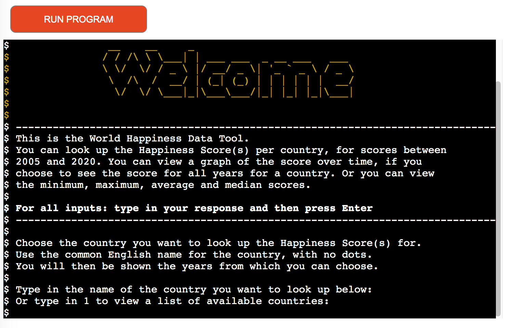
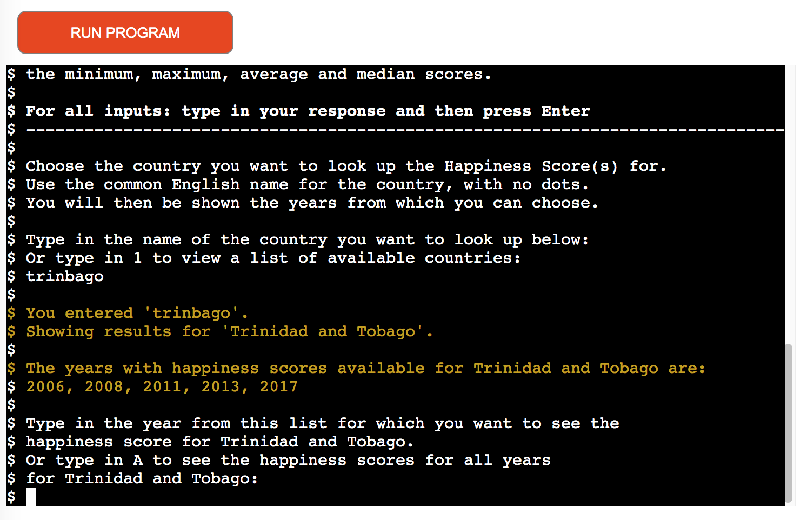
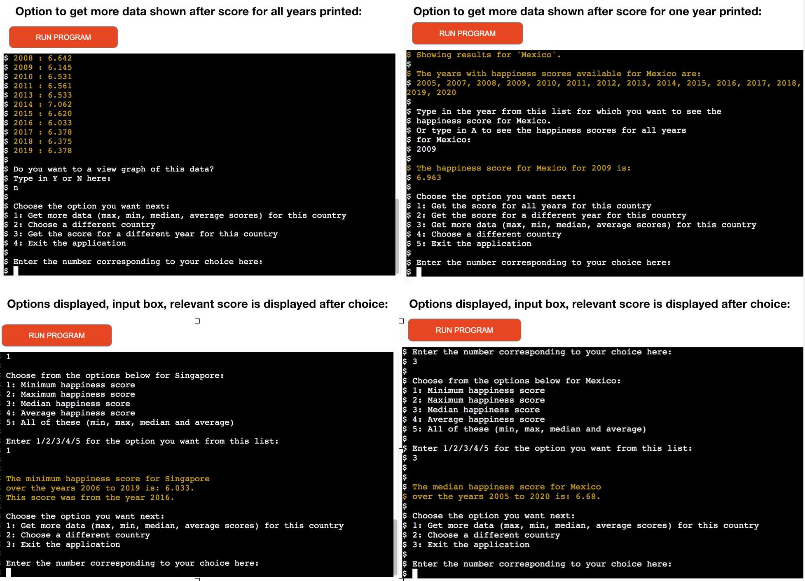
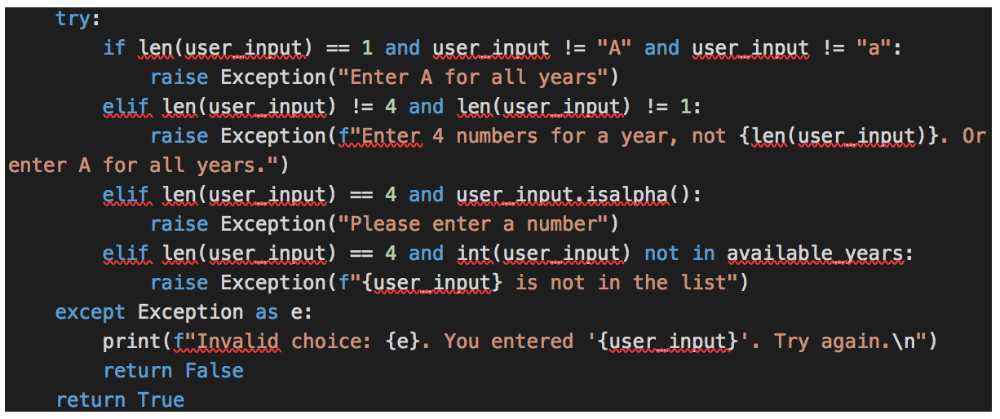
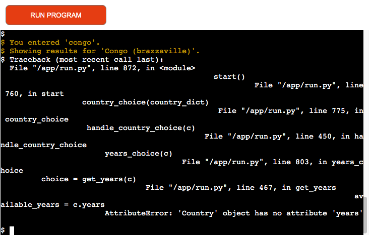

# World Happiness Data - Testing file
---
*This file contains the Testing section of the [full README.md file for World Happiness Data application](README.md).*

## Table of Contents

## Testing
---
### Code Validation
The Python code has been validated using [PEP8 online checker](http://pep8online.com/). Errors that were raised were: `line too long (86 > 79 characters)` relating to strings for user input that were too long. This was corrected by wrapping the string onto multiple lines.

 There are no validation errors in the sumitted code.

### Test Cases - user stories
This section covers testing the user stories from the [User Experience (UX)](#user-experience-ux) section. All users are visiting users since there is no user registration/login to the application.

1. **Expectation:** *As a visiting user, I want to understand what data I can access from the application so that I know what information I can get from it*
>**Result:** Pass
- When the application starts, there is a short intro text explaining that:
    - the tool allows you to look up the happiness score for a country and the years covered, 
    - they can view a graph of the score and 
    - they can view the minimum, maximum, median and average happiness scores for a country

In the paragraph below this, the user is also told that they will see the years available for that country once they choose a country. 

2. **Expectation:** *As a visiting user, I want to be able to choose a country so that I can view the data related to that country*
>**Result:** Pass
- The user can type in the name of the country that they want to view the score(s) for. After the country name has been validated as a country that exists in the dataset, the application prints back to the user the name they entered, along with the name of the country from the file, so that it is clear to the user which country results are being shown for. (In some cases, the user may type in an 'alternative' name for a country, e.g. 'us' for 'United States' so this message is to ensure clarity)

3. **Expectation:** *As a visiting user, I want to see the happiness score for a particular year (from those available) for my selected country*
>**Result:** Pass
- The application presents a list of the years available for the chosen country. The user then types in the specific year that they want to see the happiness score for.
- They can then select number 2 from the next menu shown, to view the score from a different year (or 1 from that menu to see the score for all years)

4. **Expectation:** *As a visiting user, I want to be able to see the happiness score over time for a particular country, so that I can see the scores and trends over time for that country*
>**Result:** Pass
- The application presents a list of the years available for the chosen country, as shown in the user story 3 screenprint. The user is instructed to enter A if they want to view the happiness score for all of these years, instead of just a single year. The scores are then displayed as shown below, "year : score" for each available year.
- If the user originally chose to view the happiness score for a single year, they can still view the happiness score for all the years by selecting option 1 in the next menu as in user story 3. 

5. **Expectation:** *As a visiting user, I want to be able to see a graph of the happiness score over time for a particular country so that I can visualise the data more easily*
>**Result:** Pass
- After the scores for all years are presented to the user, they are given the option to decide if they want to view a graph (y/n question), as shown in user story 4 screenprint. 
- If they select "y", then the graph is displayed in the terminal, with the years along the bottom and the happiness scores over time tracked on the line graph

- The graph remains on the screen until the user enters something in the next input box, they are then shown the next options as shown below

6. **Expectation:** *As a visiting user, I want to be able to see the maximum, minimum, average and median happiness score for my selected country.*
>**Result:** Pass
- The user is given the option to choose to view more data (minimum, maximum, median and average scores) in the menu after they have viewed the graph as shown in user story 5, (or they are shown this straight away if they chose "n" for the graph question), and also in the menu choice after they view the score for a particular year, as shown in user story 3.
- On selecting this option, the user is given a menu with 5 choices:

- The user can select number 5 which will display the minimum, maximum, median and average scores for the chosen country:

7. **Expectation:** *As a visting user, I want to be able to select one option at a time from: maximum, minimum, average and median happiness score for my selected country.*
>**Result:** Pass
- The user is given the option to choose to view more data (minimum, maximum, median and average scores), as explained above in user story 6. 
- On selecting this option, the user is given a menu with 5 choices, as shown above in user story 6
- The user can select number 1, 2, 3 or 4, corresponding to their choice, which will display the minimum, maximum, median or average scores for the chosen country (depending on which option they chose). In the below example, the minimum score is displayed:

- After the relevant score is displayed, a new menu is shown from which the user can again select number 1, to "Get more data (max, min, median, average scores)", and they will then be shown the 5 options again, they can select again from these options. E.g. if they viewed Minimum score, they can now view Maximum score if they want.
- Maximum score displayed:

- Median score displayed:

- Average score displayed:

8. **Expectation:** *As a visiting user, I want to see the list of available countries so that I can ensure to choose a country from the list.*
>**Result:** Pass
- As shown in user story 1, the user is given the option to view a list of the available countries by inputting '1' instead of inputting a country name. If they choose this option, then the list of countries is displayed in the terminal with a reminder to the user to scroll up/down as needed (due to the length of the list). 
- The user can then enter the chosen country name in the input at the bottom of the terminal window as shown below:

### Features Testing
- **Welcome message: Expectations**
  - short note on the purpose of the application
  - first thing the user sees when starting the application
>**Result:** Pass
  - the welcome message is visible in the terminal window on starting the application, as shown below:
  

- **User country choice, user view list of countries: Expectations**
  - user can input the country name they want
  - user can choose to view the list of available countries, before typing in their choice of country
>**Result:** Pass
  - the first input for the user is to either type in their choice of country, or press 1 to view a list of countries
  - the user can do either option
  - if they press 1 to view the list, then they can type in their choice of country after viewing the list
  

- **Exception handling for country choice: Expectations**
  - a number, except 1 (for list of countries) entered will generate an error message
  - a name that is not in the list of countries, or a string, or a mix of letters/numbers/symbols will generate an error message
  - the terminal window will continue to display the request to choose the country (or input 1 to view the list) until a valid input is received

>**Result:** Pass

As shown below:
  - a number input generates a specific error message
  - a string/mix of letters/symbols/numbers not in the country list generates a specific error
  - the choose country message and input box is shown again each time
  

- **Show available years for chosen country: Expectations**
  - after the country choice has been validated, display list of years that have scores recorded, for the user to choose from (since scores do not exist for every year for each country)
  - unless country only has one score recorded (see separate feature for these countries later on below)

>**Result:** Pass
  - after the country is chosen, and is valid, the list of available years is shown for that country
  - these match the years available in the source csv file
  

- **Ability for user to choose to view score for single year, or all years: Expectations**
  - user can input a year from the list of available years for the country, to see happiness score for that year
  - the relevant score will be printed to the terminal, along with corresponding year
  - or user can choose to view happiness scores for all years for that country
  - the scores and corresponding years will be printed to the terminal

>**Result:** Pass
  - both options (one year or all years) are available to the user, and both options print the correct results to the terminal
  - selecting A brings up all years, or the specific year gets the score for that year
  - the scores correctly match the scores and years in the source csv file
  

- **Exception handling for year(s) choice: Expectations**
  - if length of input is 1, but not A or a, generate an error message as user may be trying to input 'A' for all years
  - if input can't be converted to integer, generate an error message as any further valid inputs (as a check has already been done if the input was A) must be possible to convert to an integer 
  - if the input can be converted to integer, but the length is not 4, generate an error as the years are all 4 digits, or if the length is not 1, generate an error in case user is trying to input 'A' (even though A cannot be converted to int, but in case they are trying to input A and pressed a number instead)
  - if the input can be converted to int, and the length is equal to 4, but the input is not in the list of years for that country, generate an error 
  - the terminal window will continue to display the request to choose the year (or input A for all years) until a valid input is received

>**Result:** Pass

As shown below:
  - the relevant incorrect inputs generate the relevant specific error messages
  - the choose year message and input box is shown again each time
  

- **Option to choose to view graph of happiness score over time: Expectations**
  - if the user chose to view scores for all years, present this option to them (the option is not applicable if they viewed just a sinlge score as a graph would not be relevant then)
  - user can enter Y to view the graph 
  - the graph displays the scores for that country along a line graph tracking across the years
  - user can enter N to skip this step and go straight to next step

>**Result:** Pass
- user can enter Y or N to the graph question
- graph is displayed if Y entered
- application skips graph and goes to next options if N entered
- graph question is not displayed when user chose a single year to view score for
 

- **Exception handling for Y/N choice: Expectations**
  - if the input is a number, generate an error message as the input should be a letter
  - if the input is anything other than Y, y, N or n, generate an error message as these are the only acceptable inputs
  - the terminal window will continue to display the request to enter Y or N to view the graph until a valid input is received

  >**Result:** Pass

As shown below:
  - inputting a number generates an error message
  - inputting anything else that is not Y/y/N/n generates an error message 
  - the graph question and input box is shown again each time
  

- **Option to view all years scores after viewing single year: Expectations**
  - user previously selected to view score for a particular year, after this score is printed, user should have option to view score for all years for the same country
  - if chosen, the score for all years should be printed to the terminal 

  >**Result:** Pass
  - user presented with list of options after viewing single score, option 1 is to get the score for all years for the same country
  - if option 1 is chosen, then score for all years is printed to the terminal
  

- **Option to choose different year for score, after viewing all years or single year score: Expectations**
  - user previously selected to view score for a particular year, or for all years, after the result is printed, user should have option to choose a different year to get the score for, for the same country
  - if chosen, then they are presented with the 'choose years' message displaying list of years, and input box to input the selected year (or A for all years)
>**Result:** Pass
- user presented with list of options after viewing all years' scores, option 3 is to get the score for a different year for the same country
- user is presented with list of options after viewing single year score, option 2 is to get the score for a different year for the same country
- if option 3 (all years path) or 2 (single year path) is chosen, then the list of available years is displayed, along with input box
- relevant score is displayed when chosen

- **Option to view min, max, median, average scores or all of these together: Expectations**
  - option can be chosen after single year score or all years scores were printed to terminal
  - user can choose a single option e.g. maximum score
  - user can choose to view all of them (min, max, average, median) together
>**Result:** Pass
- user presented with list of options after viewing all years' scores (and graph if selected), option 1 is to get 'more data' (min, max etc.) for the country
- user is presented with list of options after viewing single year score, option 3 is to get 'more data' (min, max, etc.) for the country
- if the user chooses option 1 (all years path), or option 3 (single year path), then the list of options is displayed 
- user can individually select to view any of min, max, median, average or they can select to view all of them

- **Option to select another option from min, max, median, average scores after initial choice: Expectations**
  - after selecting an option 1-5 from the min, max, median, average, all, the result is printed and the user is presented with a further menu option
  - the new menu contains an option to get 'more data' (min, max etc.) again, so that they can choose another min/max etc. option
  - the 5 options are presented again, regardless of which option (1-5) was chosen previously
 >**Result:** Pass
- user presented with list of options after viewing previous choice (min, max etc.)
- option 1 is to get 'more data' (min, max etc.) for the same country
- if the user chooses option 1 from this list, then the list of 5 options is displayed 
- user can individually select to view any of min, max, median, average or they can select to view all of them
- user can keep selecting option 1 from follow on menu, to get another option from min, max, median, average, all, until they have seen all they want and can then choose a different option from the follow on menu

- **Option to choose a different country, or exit the application: Expectations**
  - after user has viewed their data, option to choose a different country, or to exit the application (among other options)

 >**Result:** Pass
- user presented with menu which includes the option to choose a different country or exit the application, in the following circumstances:
  - after choosing to view happiness score for single year. Options are 4 and 5.
  - after choosing to view happiness score for all years (and graph if chosen). Options are 2 and 4.
  - after choosing to view min/max etc. Options are 2 and 3.
  - after the score for country that only has one happiness score recorded. Options are 1 and 2 (the only options available in this case)

- **Showing score for country that only has one score recorded: Expectations**
  - there are 5 countries in the dataset that only have a score recorded for 1 year. If the user chooses one of these countries, then:
    - there is no option to choose a year (as this is irrelevant)
    - the one score and year is shown, along with note stating that this is the only score available
    - options are shown to choose a different country or exit the application
>**Result:** Pass
- all of these are present, as shown below:   

- **Exception handling for inputs relating to numbered options: Expectations**
  - if input can't be converted to integer, generate an error message as only numbers are valid inputs
  - if length of input longer than 1, generate an error message because valid options are single digits only  
  - if the input can be converted to integer, but the number input is greater than the number of options, or is equal to zero, generate an error
  - the terminal window will continue to display the request to choose an option until a valid input is received

>**Result:** Pass
- a number entered above the number of options available generates a specific error message - this is true for the numbered options with 2, 3, 4 or 5 options
- an input of more than one character e.g. a number plus a space, generates a specific error message 
- an input of e.g. letters, symbols, or a mix generates a specific error message
- the options list and input box is shown again each time

### Fixed Bugs
The following bugs were encountered during development and during testing.
- **Issue: Creating countries dictionary: appending the year and score pair to existing country value creates a list within a list:**

In the `create_countries_dict` function, a dictionary is created from the source csv file that contains the data. The csv file contains a line per country, each line for a different year, when opening the csv file I first converted it to a list of lists. In creating the dictionary from the list of lists, the country name is the `key`, and the `value` is a list of the year and score pairs from each year. If the country has already been added to the dictionary, then the new year and score pair needs to be added to the existing `value` for that country - to create a list of year and score pairs. The original code is below:

This code resulted in the first year and score pair being added as the value, but the subsequent year and score pairs being appended as sub-lists *within* the existing list of the first year and score. As can be seen in the example below for Zimbabwe:

>Solution: Made the year, score pair a `tuple`. Added a check when checking if the `key` already exists, to also check if the `data-type` of the `value` is a `list`, and if it isn't,  convert it to a `list` before `appending` the new `value` to the `list`. I found this solution (to check instance and convert to list) in [this article from thispointer.com](https://thispointer.com/python-how-to-add-append-key-value-pairs-in-dictionary-using-dict-update/#6). The extra line of code is shown below: 

- **Issue: Title line of csv file included in country dictionary:**

This was in the `create_countries_dict` `function`.
>Solution: I had omitted to exclude the first row when creating the dictionary. Amended the line at the beginning of the iteration through `data` (which is the list of lists created when reading the csv file) from: `for sublist in data` to: `for sublist in data[1:]` in order to exclude the heading row.

- **Issue: Uniplot graph not working in `show_graph method`:**

>Solution: I was passing the list of years and list of scores to plot the graph. However since these came from the csv file, the `data-type` was `string` therefore they needed to be converted. Converted the years to `int` (so they will be whole numbers) and the scores to `float` (as they have decimal point).

- **Issue: Exception handling for `get_years input`:**

In the above test a Python error is generated instead of the custom error message "Please enter a number". The valid inputs for the `input` in `get_years` are a mix of numbers and ints, and a mix of lengths. Valid choices are: A/a with a length of 1, or else a year from the list of years for the selected country, length of 4. The code was as below, in the `validate_years function`:

>Solution: Amended the code so that a check is done in the `get_years function` to check if the `input` is A or a. If it is, this is a valid choice and the `input` does not get passed to the `validate_years function`.
Then in the `validate_years function`:
- first check if length is 1 and raise an error if it is (as the only valid input with length of 1 is A or a which is already checked for in get_years), 
- then try to convert to `int` and raises a `Value Error` if it can't. This catches the mixture of letters and symbols. 
- Then checks for length of `input`, finally checks if year is in the list, if length correct.

The revised code is below:

- **Issue: Countries with more than one word cannot be found when creating instance of Country class:**

The input is valid, but the country cannot be found in the dictionary when creating the instance of Country class. The inputs are converted to lowercase, to do the validation against the lowercase country names from the countries dictionary, the reason for this is to handle cases where the user types a mix of cases when inputting the country name. Then the input name is converted back to propercase using `.capitalize()`, to create the Country instance from the countries dictionary. This works for single word country names but not multi-word. 
> Solution: Use `.title()`, which capitalises each word, instead of `.capitalize()`, which only capitalises the first word.

- **Issue: Country alternative/alias names dictionary - only working for first key value pair when iterating:**

The '`country_alias`' `dictionary` holds alternative names for the countries, that the user might input. The `convert_country_alias` `function` checks if the name input by the user is in the `value list` in the `dictionary` for each country, if it is, sets the country name to the corresponding `key` in the `dictionary`. Below is the original code causing the bug (*this is an early version, testing with just two country `keys` in the `dictonary`, before creating the full `dictionary`*). The code functioned only for the first country, united states, and not for the second one, united kingdom.

> Solution: The error was happening because the `else` block was within the `k,v loop`. Removed the `else` block and put new `if` statement outside the `for loop` instead. Also set the new country to be the same as input country if the input country is not in the alias list. 

- **Issue: Creating instance of `Country class` when country only has one score entry in the csv file:**

This error happens because the `self.di` can't be created - this is the `dictionary` created from `self.scores`, which is `list` of `tuples` like: [(year, score), (year, score)]. There are 5 countries in the source csv file that only have one entry - i.e. only one happiness score recorded for one year.
> Solution: amended the instance variables for `Country class`. The `self.di`, `self.scores_list` and `self.years_list` do not need to be created for these countries. Amended the `__init__ `method for `Country` `class`, to only create these attributes if the `self.scores` `data-type` is `list` (as the single score country's `self.scores` is a `tuple`).

- **Issue: Capitalising of 'And', 'Of, etc. in country names:**

As perviously mentioned, the user input country name is converted to lowercase for validation, and after validation they are capitalised using .title(), in order to create the instance of Country class using the country name in the dictionary of countries. Using .title() capitalises *all* words in the country's name, including 'and', 'of', etc., but these words are not capitalised in the csv file from which the dictionary is created. See above, 'trinidad and tobago' is converted to 'Trinidad And Tobago', instead of 'Trinidad and Tobago'.
 
> Solution: Using the guidance shown [in this article from kite.com](https://www.kite.com/python/answers/how-to-titlecase-a-string-in-python), created a small function `convert_to_titlecase` to capitalise each word except those in a list of exception words such as 'and', 'of'. Note: I included ‘region’ in the list of exceptions also as this word is not capitalised in the csv file.

- **Issue: Passing choice from numbered options to handle_options function:**

The number entered by the user has 1 deducted from it, to get the corresponding option by index number from the tuple of options: 

    choice = input(
        "\nEnter the number corresponding to your choice here: \n")
    opt_chosen = options[int(choice)-1]

This is passed to the handle_options function to decide the next path. However if an invalid input is entered, this throws an error as shown above without showing a custom error message to the user.
> Solution: The line `opt_chosen = options[int(choice)-1]` was happening after the user input but before the input was validated. Moved this line so that it happens after the validation:

    choice = input("\nEnter the number corresponding to your choice here: \n")
        if validate_options(choice, len(options)):
            opt_chosen = options[int(choice)-1]
            break

- **Issue: Graph too big for terminal window:**

As there is an input underneath the graph, for the user to press a key to continue, this pushed the graph up in the terminal window and it could not be viewed without scrolling up.
> Solution: There is an option within the uniplot plot function to set the height (defaults to 17 if not set). Added a slightly smaller height of 16 so that full graph fits in terminal window with space around.

- **Issue: function `convert_to_titlecase` not working for country name "Hong Kong SAR of China":**

There are a couple of issues with this country name:
1. There are dots in the name, this is the only country in the csv file that has dots in the name, and other abbreviated names do not have dots in them. The user instructions tell the user to enter the country name with no dots, to avoid any confusion e.g. entering U.K., or U.K, instead of UK. So this is just an inconsistency in the data in the csv file and can be amended.
2. The `convert_to_titlecase` function capitalises only the first letter in the abbreviation instead of all three letters.
> Solution: as follows:
1. Remove the dots from the name in the csv file as they should not be there (the `convert_to_titlecase` function could be updated to deal with these dots, but it would cause confusion since no other abbreviated names have dots in them)
2. Amended the `convert_to_titlecase` function, to have a `list` containing words that need to be all caps (there is currently only one word in the list but more could be added if the application was extended to work with other datasets). If the word is in this `list`, then use `.upper()` to change all letters to uppercase instead of just the first letter.

- **Issue: function `convert_to_titlecase` not working for country names with parentheses in the name:**

> Solution: As can be seen from the screenprints above, the issue is that the first letter of the word inside the parentheses is not getting capitalised by the `convert_to_titlecase` function (as the string is split into 'words' at the spaces, so the parentheses are seen as part of the 'word'). Added another `else` clause to the `list comprehension` that creates the `list` of converted words:

    else
        word[0] + word[1:].capitalize() if word.startswith("(")

If the word starts with a "(", then get the first item from the word - which is the opening parenthesis, then capitalise the second item in the word, which is the first letter.

- **Issue: Line wrapping on the list of countries when printed to the terminal:**

As can be seen above, when the list of counties is printed to the terminal, it is not wrapping correctly as the line breaks happen in the middle of words, which is confusing for the user. In addition, the text at the top of the list, informing the user of the error is not visible in the window. The countries list was originally printing to the terminal if the user enters an incorrect country name - to help them choose a correct country name.

> Solution: Amended the printing of the list, to print each item in the list on its own line, this way it is easy for the user to see each country name. This generated a further error in that the `"\n"` for new line, that was needed as part of the `.join()`, i.e. `"\n".join(countries)` was not allowed inside the `f-string` curly brackets `{}`. This part was solved by creating a variable called `new_line`, holding the `"\n"`, as described in [this post on towardsdatascience.com](https://towardsdatascience.com/how-to-add-new-line-in-python-f-strings-7b4ccc605f4a) and using the variable name inside the `f-string` curly brackets `{}` like so: `f"{new_line.join(countries)}"`. Also added text at the bottom of the list instructing user to scroll up to view the full list (there is no other way around this since the terminal window is fixed size, and even printing several countries to a line does not fit in the window), and added text at the top reminding user to scroll back down to make their selection. Finally, instead of including this list within the error message if the user chooses a country that is not in the list, I decided it would be a better user experience to have the option to view the list of countries, *before* inputting their chosen country name. Updated the `get_country` function to allow user enter 1 in the input box, instead of a country name, if they want to view the list of countries, if 1 is entered then this calls the function `display_country_names`, which prints the list of country names in the terminal as described earlier. 

### Manual Testing
### Supported Screens and Browsers